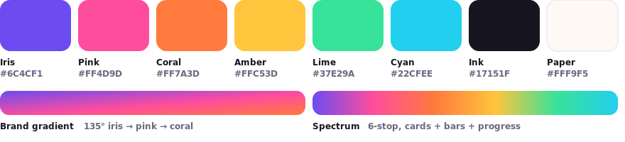

<p align="center">
  
</p>

<h1 align="center">Pressroot <sup><em>Beta</em></sup></h1>

<p align="center"><strong>Your brand in. Your site out.</strong><br>
The AI site-builder WordPress theme: answer a short brand questionnaire and Pressroot generates the whole site —<br>
design, pages, copy, images, navigation, header, and footer — all on core Gutenberg blocks. Free AI by default.</p>

<p align="center">
  <a href="https://matthummel-pa.github.io/pressroot/">Website</a> ·
  <a href="https://matthummel-pa.github.io/pressroot/documentation.html">Documentation</a> ·
  <a href="https://matthummel-pa.github.io/pressroot/testers.html">Become a tester</a> ·
  <a href="https://matthummel-pa.github.io/pressroot/collaborate.html">Collaborate</a> ·
  <a href="https://matthummel-pa.github.io/pressroot/feedback.html">Feedback</a> ·
  <a href="CHANGELOG.md">Changelog</a>
</p>

<p align="center">Stack: Sage 11 · Blade · Tailwind CSS v4 · Vite · Acorn (Laravel-in-WordPress) · PHP 8.3 · v1.7.0 · MIT</p>

---

> **Open beta.** Pressroot is being tested on real businesses right now — testers get a free domain and keep their site. [Join the beta →](https://matthummel-pa.github.io/pressroot/testers.html)

## How it works

**New: the Setup wizard.** Appearance → Pressroot now opens on a seven-step guided flow — **Business info → Connections → WordPress settings → Design → Generate → Review → Launch** — that takes a blank install to a launched site: business facts (contact, hours, mission) that feed the AI brief, AI provider keys, an SEO plugin selector, Google Analytics (paste a GA4 ID, gtag injected) with GA + Google Business Profile walkthroughs, one-click WordPress settings, site generation, a review screen, and a real launch button that publishes the drafts. Progress saves per step; every step stays revisitable. ([docs/SETUP-WIZARD.md](docs/SETUP-WIZARD.md))

Under the hood it sequences the same engines:

1. **Tell it your brand** — Theme Settings + the Brand questionnaire are the *core prompt for your entire site*: name, one-liner, industry (dropdown), audience, voice, goal, imagery, density, design trend, plus free-form **AI instructions** (WYSIWYG, 1,000-word cap) and uploadable **`.md` instruction files**. Everything compiles into one saved **CORE SITE BRIEF** prepended to every AI call.
2. **Save — it builds** — the status bar runs the pipeline: compile the brief → deal a design (kit + trend filtered by your answers) → generate pages on core blocks → build the **site chrome** (nav menu, goal-driven header CTA, brand-driven footer) → prime smart-block copy.
3. **Refresh until you love it** — every 🎲 deals a genuinely different theme (never repeating the current one); your brand color and content survive every deal.

The whole theme wears the [Repofolio](https://github.com/matthummel-pa/repofolio) design language — iris/pink/coral gradients, spectrum-topped cards, gradient pill buttons — and Repofolio itself ships inside as a theme addon.

## Features

### The generator (Pressroot AI)
- **Theme Settings = the prompt** — one tab consolidates identity, the full brand questionnaire, AI instructions, and instruction-file uploads. Design settings (kit, colors, fonts, corners, hero copy) are **written in the backend by the build**; manual controls unlock as a collapsed fine-tuning panel after the first save, so owners never fight the generator. "✨ Generate my brand with AI" drafts the questionnaire from just a name + one-liner.
- **Site Types ×8** — Restaurant/Café, Real Estate, Affiliate Marketing, Agency/Studio, Freelance/Portfolio, SaaS/Startup, Blog/Content, Marketing/Landing. Each ships starter pages, per-industry **marketing questions** the AI treats as hard facts, and matched design pools. Live previews render in the owner's own design (gated until first setup save, always cache-busted).
- **🎲 Refresh = a whole new theme** — random layout variants per page, a random Style Kit from the type's pool, and a random design trend — brand-filtered, never repeating, branding re-asserted last, caches flushed.
- **Core blocks only (default)** — generated pages use core Gutenberg blocks + coded theme blocks (`prt/smart-hero`, `prt/smart-cta` with auto-generated copy). **No Custom HTML blocks, ever.** The AI writes text and images only — block markup is never AI-touched, so pages can't break.
- **Full site chrome** — builds generate the shell too: a synced "Pressroot Menu" assigned to the primary location (hand-made menus never touched), a goal-driven header CTA (Get a quote / Shop now / Book now / Subscribe) pointing at the most relevant page, and a footer with your description as tagline on a light/dark ground.
- **Edit-screen AI tools** — AI-write, AI-image, and new-design actions plus per-role suggested blocks right on page/post edit screens.
- **AI models** — per-provider dropdowns, validated on save and read: keyless **Pollinations** (text + images, the free default), **Anthropic** (Claude Opus/Sonnet/Haiku), **OpenAI** (GPT + gpt-image-1), **Google Gemini**, **Groq**, **OpenRouter**, **Stability** (SD 3.5); Luma/Runway video keys stored for the upcoming AI video hero. Keys live server-side only, masked in the UI, with automatic free fallback — **the default stack costs $0**.
- **"Powered by AI — or not"** — one switch disables every AI call; the design generator keeps working without it.

### Design system & theming
- **Tokens-first** — colors, type scale, spacing as Tailwind v4 `@theme` variables; re-skin from one place.
- **13 Style Kits** — six originals + the Repofolio family (Iris Dark, Pink Pop, Coral Cream, Mint Fresh, Cyan Sky, Amber Toast) + a reserved **Core Marketing** kit.
- **6 design trends** — CSS-only layers: Bento spectrum, Glassmorphism, Neo-brutalist, Editorial serif, Swiss minimal, Retro pop.
- **Dark mode** — light / dark / auto, no-flash, dedicated dark navbar surface.
- **`theme.json`** — spacing, border, shadow, fluid type, gradient, duotone controls in the editor.

### Hero, header, footer & content
- **Hero builder** — fully generic base-theme hero (every string a Customizer mod), 1–3 columns, media, background modes, entrance animation; built-in image finder (Openverse/Unsplash/Pexels/AI-generate) imports straight to the hero.
- **Header & nav** — sticky/shrink/transparent behaviors, flexbox nav control, off-canvas popout, mega menu, scheduled announcement bar.
- **Footer builder** — 1–4 columns, palettes, tagline, author credit.
- **Header & Footer designer** — six header presets and four footer presets with live SVG previews; picking a preset live-syncs the fine-tune fields (sticky, scrim, transparent scope, text scheme). Includes a true transparent-over-hero header and a real-image hero, both kept AA-contrast-safe by a render-time palette guard.
- **Blocks & patterns** — Social Icons, Icon (Blade), Post Grid, GitHub repo blocks, 22 starter patterns + ~50 generated remix patterns, Pattern Library admin page.
- **Reading UX, forms, performance, SEO** — auto TOC, reading progress, plugin-free contact form, newsletter, cookie notice, split block CSS, critical CSS, local fonts (1,500+ Google families), OG/Twitter/JSON-LD (auto-off under Rank Math/Yoast), white-label + onboarding checklist.

### Addons

Three optional feature modules, each toggled under **Customizer → Theme Options → Theme Addons** and each also shipping as a standalone WordPress plugin — the theme edition and the plugin share the same data, post types, and settings, so you can run either and migrate in either direction.

- **[Repofolio](https://github.com/matthummel-pa/repofolio)** — turn your GitHub repos into a living portfolio: a server-rendered repo-grid block, "Connect with GitHub" OAuth, and a project case-study post type. Steps aside automatically when the standalone Repofolio plugin is active.
- **[Pressroot Blockifier](https://github.com/matthummel-pa/pressroot-blockifier)** — design in HTML, ship in blocks: write a Custom HTML block freely, then convert it to native Gutenberg blocks with one click — per block from the toolbar, or a whole-document Blockify.
- **[Pressroots Reserve](https://github.com/matthummel-pa/pressroots-reserve)** — bookings & reservations for restaurants, hotels, and meetings: a `prt_service` post type (appointment or seats-per-slot with party size), a timezone-aware availability engine that never double-books, a booking form (`prt/booking` block + `[prt_booking]` shortcode), confirmation emails with an `.ics` attachment and a tokenized cancel link, and a **Month/Week/Day/List admin calendar**. Opt-in in the Setup wizard. ([docs/PRESSROOTS-RESERVE.md](docs/PRESSROOTS-RESERVE.md))

### Setup wizard (new)
- **Seven guided steps** — Business info → Connections → WordPress settings → Design → Generate → Review → Launch — resumable per step, overall progress bar, and an animated per-form status bar so long AI runs never look frozen.
- **Business facts feed the AI** — mission, what-you-do, contact, per-day hours, and media uploads all compile into the CORE SITE BRIEF, so generated copy quotes real facts.
- **Google Analytics in one paste** — validated GA4 Measurement ID, official gtag.js auto-injected (with GA + Google Business Profile walkthroughs built in).
- **SEO plugin selector** — built-in SEO layer by default, or Yoast / Rank Math / All in One SEO with live status, one-click install/activate, and a beginner's SEO primer.
- **WordPress settings, handled** — timezone, pretty permalinks, site icon, search visibility, and comment defaults explained and applied in one click.
- **A real launch** — pre-flight checklist, publish all generated drafts, set the front page, open the doors to search engines.

### Settings, developer tools & support
- **Appearance → Pressroot** — one page, tabbed in the Repofolio docs-site design: **Setup → AI Models → Theme Settings → Site Types → GitHub → Support** (plus a **Bookings** tab when Pressroots Reserve is enabled), with build status bars on every generate.
- **Export / Import / Reset**, **WP-CLI suite** (`wp pressroot ...`), **Hook Registry**, **Dev Mode** debug panel.
- **Extensible by design** — every public filter and pattern lives under the `pressroot/*` namespace (indexed in `app/hooks-registry.php`); the settings-tab registry is filterable (`pressroot/settings_tabs`) so addons can register their own sections.
- **Hardened & disclosed** — capability + nonce checks on every action, SSRF-guarded image imports, API keys never exported or sent to the browser, per-IP contact-form throttling, focus-managed navigation and reduced-motion support (WCAG 2.1 AA effort), and a complete [third-party services & privacy disclosure](docs/THIRD-PARTY-SERVICES.md).

## Brand & theme colors

<p align="center">
  
</p>

| Token | Hex | Used for |
|---|---|---|
| **Iris** | `#6C4CF1` | Primary brand / actions / links |
| **Pink** | `#FF4D9D` | Gradient mid-stop, accents |
| **Coral** | `#FF7A3D` | Gradient end-stop, warm accents |
| **Amber** | `#FFC53D` | Highlights, chips |
| **Lime** | `#37E29A` | Success, availability dot |
| **Cyan** | `#22CFEE` | Info accents, floaters |
| **Ink** | `#17151F` | Headings, dark grounds, footer |
| **Paper** | `#FFF9F5` | Page background |
| **Hairline** | `#ECE6FB` | Borders, dividers |
| **Brand gradient** | `135° iris → pink → coral` | Buttons, logo mark, badges |
| **Spectrum** | 6-stop, all of the above accents | Top bars, card tops, progress bars |

All tokens live as Tailwind v4 `@theme` variables in [`resources/css/app.css`](resources/css/app.css) and in [`theme.json`](theme.json); the full spec — voice, palette, gradients, type, card anatomy, motion — is in **[DESIGN-SYSTEM.md](docs/DESIGN-SYSTEM.md)**, with visual previews of how the theme looks: the [design language sheet](docs/brand/design-language-sheet.svg) and [theme preview boards](docs/mockups/theme-previews.svg) (marketing site · generated business site · Setup wizard). Style Kits and the design generator recolor *on top of* these — the Repofolio palette is the theme's own identity.

## Requirements

| Tool | Version |
|---|---|
| PHP | 8.3+ |
| Composer | 2.x |
| Node | 20.19+ or 22.12+ |
| WordPress | 6.6+ |

## Quick start

```bash
composer install
npm install
npm run build      # or: npm run dev  (Vite HMR)
npm run wp         # zero-Docker local WordPress (Playground) at 127.0.0.1:8881
```

Activate **Pressroot** and open **Appearance → Pressroot** — it lands on the **Setup wizard**, which walks you from blank install to launched site in seven steps (business info, connections, WordPress settings, design, generation, review, launch). The free keyless AI defaults work with zero configuration. Power users can skip the wizard and drive Theme Settings + Site Types directly. Full walkthrough in the [documentation](https://matthummel-pa.github.io/pressroot/documentation.html); a field-by-field worked example lives in the [restaurant build recipe](docs/BUILD-RECIPE-RESTAURANT.md).

## Docs & history

- [Documentation site](https://matthummel-pa.github.io/pressroot/) — marketing site, docs, tester program, feedback form (served from [`docs/`](docs/))
- [SETUP-WIZARD.md](docs/SETUP-WIZARD.md) — the seven-step onboarding flow, every handler and key
- [DESIGN-SYSTEM.md](docs/DESIGN-SYSTEM.md) — the design language, with visual theme previews
- [THEME-SETTINGS.md](docs/THEME-SETTINGS.md) — every control, cataloged
- [THIRD-PARTY-SERVICES.md](docs/THIRD-PARTY-SERVICES.md) — privacy & external-services disclosure
- [MARKETPLACE-READINESS.md](docs/MARKETPLACE-READINESS.md) — audit report + submission checklist
- [ARCHITECTURE.md](docs/ARCHITECTURE.md) · [DEVELOPMENT.md](docs/DEVELOPMENT.md) · [BRAND-DESIGN-SYSTEM.md](docs/BRAND-DESIGN-SYSTEM.md)
- [BUILD-NOTES.md](docs/BUILD-NOTES.md) — the chronological build log (root cause → fix → takeaway)
- [PRESSROOTS-RESERVE.md](docs/PRESSROOTS-RESERVE.md) — the bookings & reservations addon (services, engine, widget, calendar, hooks)
- [CHANGELOG.md](CHANGELOG.md) — versioned release notes

## Contributing & testing

Beta testers get a free domain and keep their site — see [Become a tester](https://matthummel-pa.github.io/pressroot/testers.html). Code, site types, style kits, recipes, and translations are all welcome — see [Collaborate](https://matthummel-pa.github.io/pressroot/collaborate.html) and [CONTRIBUTING.md](CONTRIBUTING.md).

## License

MIT © 2024–2026 [Matt Hummel (matthummel)](https://github.com/matthummel-pa)
