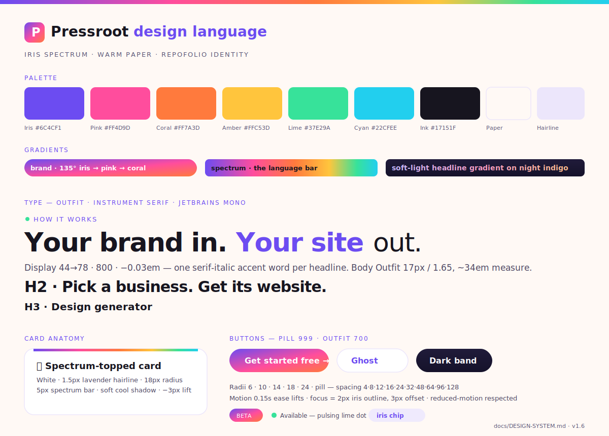
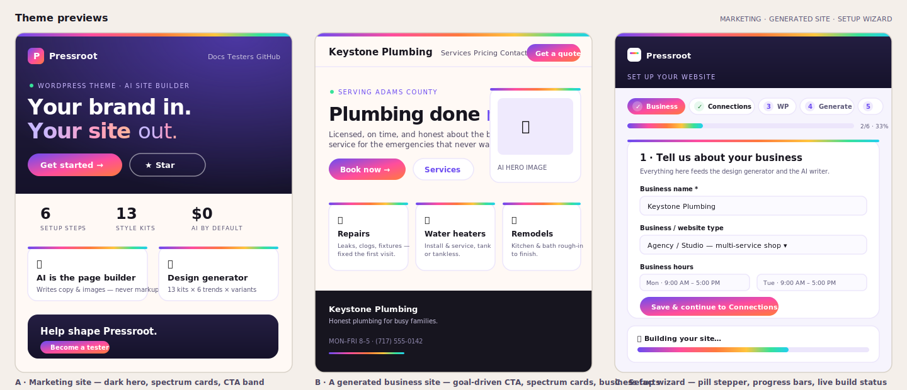

# Pressroot design system

*"Your brand in. Your site out."* — the current, canonical design language of Pressroot. This document was produced from the **Pressroot Design System** project built with Claude Design (reverse-engineered from the theme's own CSS — `resources/css/app.css`, `brand.css`, `design-language.css`, `admin-settings.css`, and the docs site), so every value here is what the code actually ships, not aspiration.

> **Supersedes** the older "Paper + green" [BRAND-DESIGN-SYSTEM.md](BRAND-DESIGN-SYSTEM.md), which documents the original matthummel.com identity. Pressroot wears the **Repofolio identity**: an iris-led spectrum on warm paper.

## Previews — how the theme looks

Three surfaces, one language: **(A)** the marketing site's dark night-indigo hero with soft-light gradient headline and spectrum-topped feature cards, **(B)** a generated business site — goal-driven header CTA, iris actions, business facts in the footer, and **(C)** the six-step Setup wizard with its pill stepper and live build status bars. For live previews, run `npm run wp` and open the Site Types tab, or visit [the docs site](https://matthummel-pa.github.io/pressroot/).

## Content fundamentals

North star: **"Say less, mean more."** Brevity is the bold move; whitespace and bold type carry the message.

- **Voice** — clear, confident, friendly, plain-spoken. No jargon walls; a little wit is welcome.
- **Headlines** — 3–7 words, value not feature, sentence case: *"Your brand in. Your site out."*, *"Pick a business. Get its website."*, *"Three steps. No page builder. No lock-in."*
- **Buttons** — verbs, 1–3 words, primary CTAs often trail an arrow: *Get started free →*
- **Eyebrows** — short mono uppercase kickers with `·` separators: `WORDPRESS THEME · AI SITE BUILDER · v1.6`
- **Emoji are content** — exactly one leading glyph per feature/step/site-type element (✨ 🎨 🧭 💸 🏪 🐙 🚀 📈 🔒); the 🎲 die is the running motif for "deal a new design." Never decorative filler; never where a real icon belongs.
- **The serif flourish** — one Instrument Serif *italic* accent word inside an otherwise sans headline ("Your site *out.*").

## Visual foundations

**Palette.** Iris-led spectrum on warm paper:

| Token | Hex | Role |
|---|---|---|
| Iris | `#6C4CF1` | Primary — brand, actions, links |
| Pink | `#FF4D9D` | Gradient mid-stop, accents |
| Coral | `#FF7A3D` | Gradient end-stop, warm accents |
| Amber | `#FFC53D` | Highlights, stars |
| Lime | `#37E29A` | Reserved: "live"/success dots |
| Cyan | `#22CFEE` | Info accents |
| Ink | `#17151F` | Headings, dark grounds |
| Body | `#4B4560` · Slate `#5A5676` | Body copy · meta |
| Paper | `#FFF9F5` | Page ground |
| Hairline | `#ECE6FB` | The signature lavender border |
| Night indigo | `#201B3A → #15122A` | Dark hero/CTA grounds |

**Gradients.** Two do almost all the work: the **brand gradient** (135° iris → pink → coral) on primary buttons, the logo mark, badges, and step numbers; the **spectrum gradient** (90°, six stops) as the language bar. On dark grounds, headline words use a **soft-light gradient** (`#C9B8FF → #FF9DC4 → #FFC08A`).

**The language bar.** The single most recognizable motif: a spectrum stripe — **8px** pinned across the top of a page/hero, **5px** across the top of every card. A Pressroot surface almost always has one.

**Typography.** **Outfit** for everything structural — display at 800/−0.03em (fluid 44→78px), H1 36→56, H2 30→42, H3 20; body 400 at 17px/1.65 on a ~34em measure. **Instrument Serif italic** for the single accent word (the public docs site substitutes Fraunces italic — both are authentic; the theme's self-hosted canonical is Instrument Serif). **JetBrains Mono** for eyebrows, stat labels, badges, and code — uppercase with 2px tracking as labels.

**Cards.** White surface · 1.5px lavender hairline · **18px radius** · 5px spectrum top bar · soft cool shadow (`0 12px 30px rgba(23,21,31,.07)`); interactive cards lift `translateY(-3px)` with a deeper shadow. Variants: flat (no bar), tint (cream), dark (night ground).

**Buttons.** Pill radius (999px), Outfit 700. Primary = gradient fill with an iris glow that deepens on hover; ghost = white + hairline + iris text; ghost-dark = transparent + white border; all lift −2px on hover.

**Backgrounds.** Warm flat paper by default. Heroes and CTA bands go dark: layered radial glows (iris top-right, pink left) over night indigo. No photographic full-bleeds in the core language — imagery sits inside spectrum-topped cards.

**Motion & states.** 0.15s ease lifts, 0.5–0.8s progress fills; pulsing lime availability dot; everything respects `prefers-reduced-motion`. Focus is a **2px iris outline with 3px offset** on every interactive element — required, not optional. Disabled = 50% opacity.

**Corners & spacing.** Radii 6 · 10 · 14 · **18 (card signature)** · 24 · pill. Spacing scale 4·8·12·16·24·32·48·64·96·128, 76px section padding, 1120px content shell. Transparency sparingly: sticky nav `rgba(255,249,245,.88)` + 12px blur; the "glass" trend applies `blur(14px) saturate(1.4)` to cards.

## Iconography & logos

Every glyph routes through `prt_icon()` (`app/icons.php`): **Simple Icons** for brand/social marks, **Heroicons** (outline) for UI. Missing icons degrade to a plain circle — never a broken page. Custom brand SVGs: `arrow-up-right`, `spark` (4-point AI sparkle), and the logo set in [brand/](brand/) — rounded-square gradient mark, wordmark (`Press`+gradient `root`), full lockups, palette sheet.

## Component inventory

The building blocks, all lifted from shipped CSS (not invented): **Button** (primary/ghost/ghost-dark/outline/link) · **Badge** (beta gradient, lime-dot available, iris soft chip) · **Pill** (tech/site-type/filter chips) · **Eyebrow** · **Card** (+flat/tint/dark) · **Stat/StatStrip** · **Note** (iris/lime/pink left border) · **CtaBand** (dark conversion band). Two full UI kits exist in the Claude Design project: the marketing site and the admin Setup wizard.

## Where the truth lives

Tokens ship as Tailwind v4 `@theme` variables in `resources/css/app.css` and in `theme.json`; the admin design system is `resources/css/admin-settings.css` (`.prt-rf-*` / `.prt-wiz-*`). Style Kits and the design generator recolor *on top of* this language — the Repofolio palette is the theme's own identity. The interactive source of this document is the **Pressroot Design System** Claude Design project (tokens, 21 foundation specimens, 9 components, 2 UI kits).
