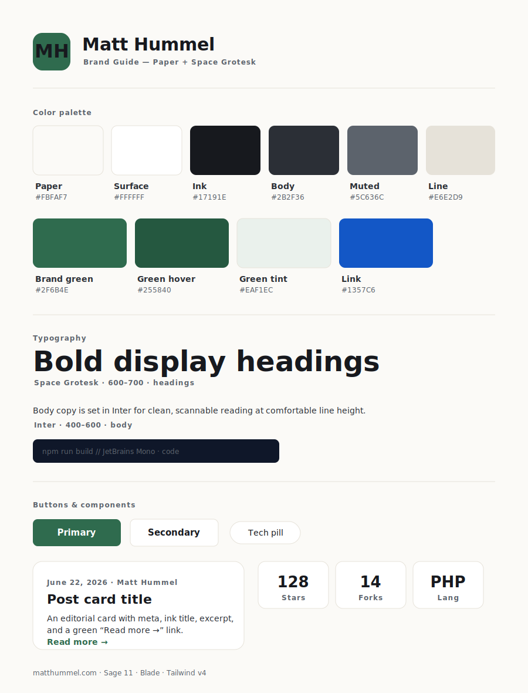
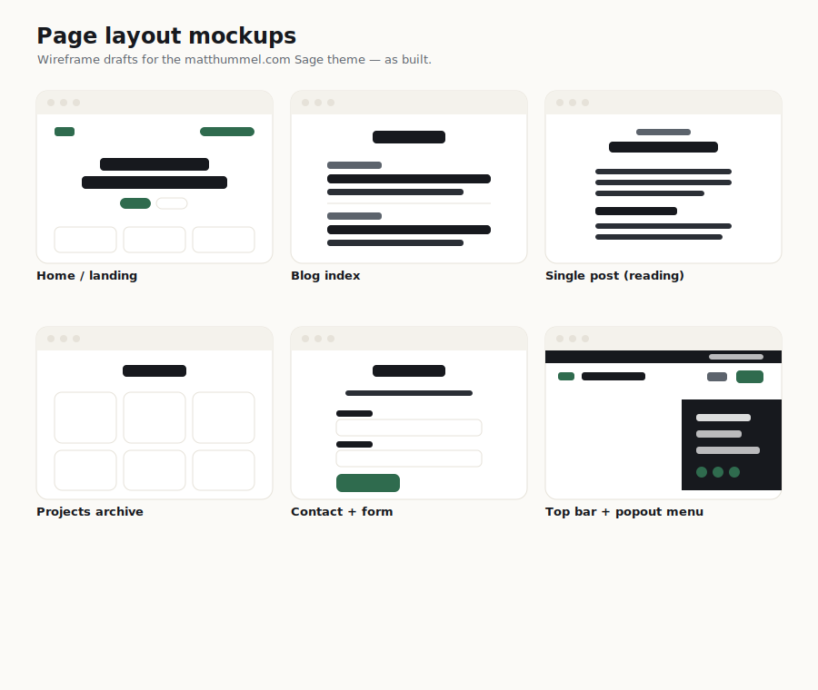

# Mockups & Branding

> **Looking for how Pressroot looks today?** The current identity (Repofolio iris
> spectrum) lives in **[DESIGN-SYSTEM.md](DESIGN-SYSTEM.md)** with theme preview
> boards: [design-language-sheet.svg](brand/design-language-sheet.svg) and
> [theme-previews.svg](mockups/theme-previews.svg). Everything below documents the
> **original matthummel.com direction** ("Paper + green") and is kept as history.

Design references for the matthummel.com Sage theme. These were drafted as the design
direction and the built theme matches them.

## Branding guide

The "Paper + Space Grotesk" system: Paper background, bold Space Grotesk headings,
Inter body, JetBrains Mono code, brand green `#2F6B4E`, and the accessible neutral +
action palette. See [BRAND-DESIGN-SYSTEM.md](BRAND-DESIGN-SYSTEM.md) for the full spec.

## Page layouts

Wireframe drafts for: **Home/landing**, **Blog index**, **Single post (reading view)**,
**Projects archive**, **Contact + form**, and the **header system** (top utility bar +
off-canvas popout menu). All are implemented and live in the theme.

## Logos

The MH mark, wordmark, and primary lockup live in [brand/](brand/).
